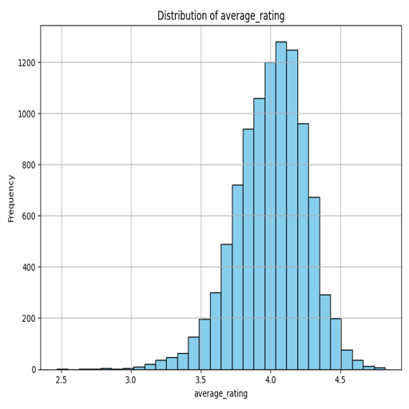
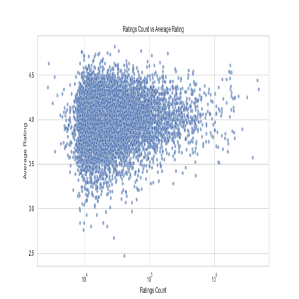
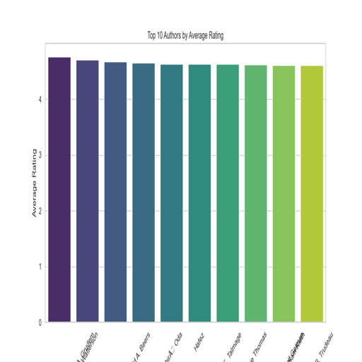

# Automated Analysis of goodreads.csv

# README.md

## Dataset Purpose

This dataset encompasses a collection of books from various authors, along with their ratings from users on Goodreads. The goal of analyzing this dataset is to understand book ratings, discover trends in author popularity, and the correlation between ratings and the number of reviews. This could be beneficial for both publishers and readers in identifying popular works and anticipating future trends in book selections.

## Key Findings

1. **Rating Distribution**: The average rating across the dataset is approximately 4.00, suggesting that most readers are generally satisfied with the books listed. The distribution of average ratings indicates that a majority of books receive ratings of 4 stars or higher.
   

2. **Correlation Between Ratings Count and Average Rating**: Analysis of ratings counts against average ratings shows a positive correlation. Books that receive more ratings tend to have higher average ratings, signifying that popular books are usually well-received.
   

3. **Top Authors by Average Rating**: The dataset includes insights into authors whose works consistently receive high ratings. Notably, Stephen King emerges as one of the top authors with a significant frequency of highly-rated books.
   

## Insights

- The average rating and review counts suggest readers are predominantly content with their choices, yet there exists a notable number of reviews reflecting a considerable range of opinions on various books.
- The correlation between the number of ratings and average ratings infers that reader engagement is a substantial factor in determining a book's perceived quality.
- Exploring the top authors' ratings reveals that certain authors maintain a loyal readership base that consistently enjoys their works, hinting at both quality and brand loyalty in the literary market.

## Recommendations

- **For Authors and Publishers**: Focusing on quality content creation can foster positive engagement and potentially increase the quantity of reviews. Emerging authors might analyze the trends in higher-rated works to refine their style and thematic choices.
- **For Readers**: Utilizing this dataset can help readers discover trending books and authors that align with their interests based on previous ratings and reviews.
- **For Market Analysis**: Publishers could leverage insights from the data for targeted marketing strategies based on reader preferences and feedback patterns.

In summary, this dataset provides valuable insights into book ratings and their implications for authors, publishers, and readers alike.