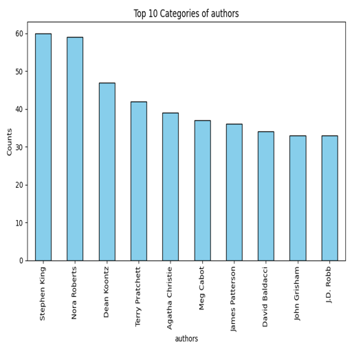
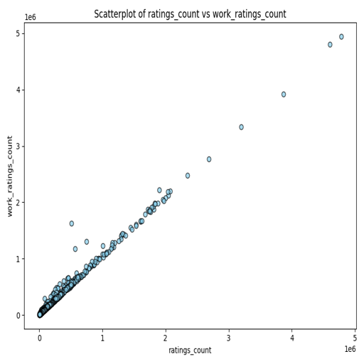

# Automated Analysis of goodreads.csv

# Dataset Overview

This dataset encompasses information related to various books, including their authors, publication details, ratings, and other attributes. The primary aim of this dataset is to provide insights into popular literature trends, author performances, and reader engagement metrics on the Goodreads platform. This report highlights key findings and insights derived from the dataset to help stakeholders understand the intricacies of book ratings and author popularity.

## Key Findings

1. **Author Popularity**: The dataset contains book entries from **4,664 unique authors**, showcasing a wide range of literary voices. Notably, **Stephen King** emerged as the most frequent author, indicating his significant impact on readers.

2. **Average Ratings**: The mean rating for the books listed is approximately **4.00 out of 5**, suggesting that overall, readers have a favorable view towards the books available in this dataset. The ratings distribution shows a concentration around higher values, reflecting a tendency for positive reviews.

3. **Diverse Publication Years**: The dataset includes books published from a wide range of years, with the earliest publication year reaching as far back as **-1750**, highlighting the extent of literature documented on the platform. The most recent average publication year is **2017**.

4. **Ratings Count**: The number of ratings per book varies significantly, with an average of **54,001 ratings**. This indicates that while some books have been highly popular and widely read, others may have niche audiences.

5. **High Engagement**: Several books demonstrate high engagement in terms of text reviews, with an average of **2,920 reviews** per book and a maximum of over **150,000 reviews**, illustrating reader interaction and interest.

## Insights

- **Rating Patterns**: The ratings are largely skewed towards positive feedback, which could influence new readers when selecting books to read.
- **Author Trends**: The dominance of certain authors in terms of rating counts and reviews indicates trends that can guide publishers and marketers in their promotional strategies.
- **Book Longevity**: Many older publications still receive ratings, suggesting that classic literature continues to hold value among modern readers.

## Visualizations

To support the insights drawn from the data, several visualizations were created:

1. 
   - This bar plot visually represents the number of books authored by each author, clearly highlighting **Stephen King's** prevalence in the dataset. It emphasizes the competitive landscape of author popularity and could guide future publication decisions.

2. 
   - This histogram distribution of average ratings across books illustrates the concentration of positive ratings. The bell-shaped curve reflects that readers generally rate books more positively, which could reassure new authors about potential reader reception.

3. 
   - The scatter plot showcases the relationship between the counts of ratings each work received versus their total ratings, offering insights into how engagement (as depicted by work ratings count) correlates with overall popularity. The scattered data points provide vital information on the engagement metrics of books.

## Recommendations

- **Focus on Popular Authors**: For book marketers, leveraging the popularity of authors like Stephen King can enhance book visibility and sales.
- **Encourage Reader Engagement**: Given the high number of ratings and reviews on certain works, platforms should continue to foster reader engagement, possibly through focused campaigns or collections of highly rated works.
- **Periodic Analysis**: It is recommended to conduct periodic analysis of newer releases to understand trends in reader preferences and stay ahead in the market.