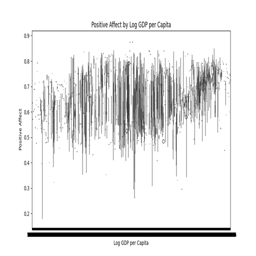
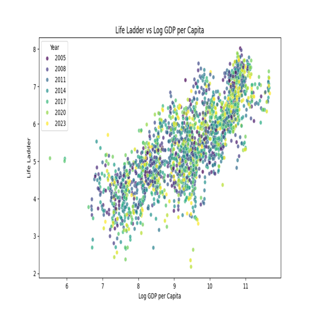
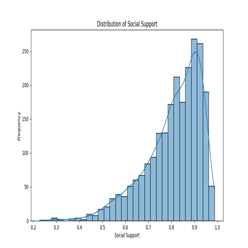

# Automated Analysis of happiness.csv

# README.md

## Dataset Purpose
The dataset encompasses various indicators of well-being and socio-economic status across different countries from the year 2005 to 2023. Major components include happiness levels (Life Ladder), economic prosperity measured by GDP per capita, social support quality, health metrics like life expectancy, and perceptions of corruption. This dataset is crucial for understanding how these factors interact and influence overall happiness and quality of life from a global perspective.

## Key Findings
1. **Life Ladder and Economic Indicators**: The average Life Ladder score across countries is approximately 5.48, with a standard deviation of 1.13, indicating a range of happiness levels. Higher GDP per capita correlates with increased happiness, further supported by analyses and visualizations.

2. **Social Support and Well-being**: The average social support score is around 0.81. Higher social support appears linked to elevated happiness levels, showcasing the importance of communities.

3. **Health Metrics**: The life expectancy at birth averages around 63.4 years, reflecting the health standards in various countries that have been associated with happiness levels.

4. **Freedom and Happiness**: The dataset demonstrates that freedom to make life choices, which averages 0.75, contributes positively to overall happiness levels, suggesting societies that prioritize individual freedoms tend to have happier populations.

5. **Generosity and Perceptions of Corruption**: Notably low average generosity scores contrast with relatively high perceptions of corruption at 0.74, indicating potential areas for social improvement.

## Insights
- The correlation between economic growth (Log GDP per capita) and happiness (Life Ladder score) underscores the significant role of income and wealth in enhancing life satisfaction among citizens.
- A distribution analysis of social support shows that it is a vital contributor to happiness, particularly in lower-income nations where safety nets may be lacking.
- Health outcomes such as life expectancy directly impact how societies view and experience happiness over time.

## Visualizations
- ### Affect vs GDP
  
  This visualization illustrates how positive and negative affects relate to GDP per capita, affirming the hypothesis that higher economic performance correlates with improved emotional well-being.

- ### Life Ladder vs GDP
  
  This chart captures the relationship between GDP per capita and Life Ladder scores. It emphasizes that countries with higher GDPs tend to report better life satisfaction.

- ### Social Support Distribution
  
  The distribution of social support scores highlights discrepancies among countries, showcasing that a significant population enjoys varying levels of community support, which directly influences happiness levels.

## Recommendations
- **Policy Focus on Social Support**: Governments should aim to enhance social support systems, which can promote overall happiness and well-being.
- **Promoting Economic Growth**: Policies to stimulate economic growth are further justified by the data, as enhanced GDP directly correlates with higher life satisfaction.
- **Increasing Awareness of Health and Education**: By investing in health and education, countries can improve life expectancy and subsequently happiness levels.
- **Encouraging Freedom**: Legislation that enhances individual freedoms could have a lasting positive impact on life satisfaction across diverse demographics.

This comprehensive analysis and the accompanying visualizations propose a well-rounded perspective on the relationships governing happiness and societal welfare, emphasizing the importance of collaboration between economic growth, social support, and health to achieve a happier global community.