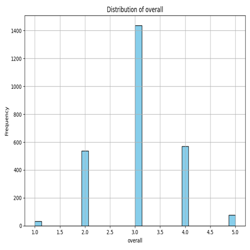
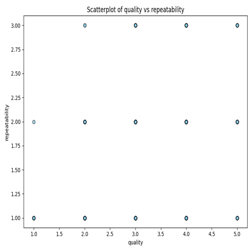
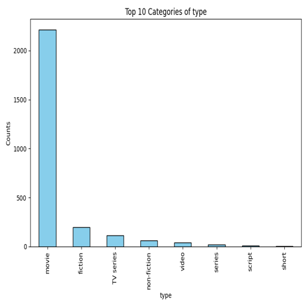

# Automated Analysis of media.csv

# README.md for Dataset Analysis

## Purpose of the Dataset
This dataset comprises various metrics related to a collection of movies, including their overall ratings, quality assessments, and repeatability scores. Additionally, it encompasses metadata such as the release date, language, type of film, title, and the actor associated with the movie. The primary objective of analyzing this dataset is to uncover insights into the factors that influence movie ratings and to understand viewer preferences across different categories.

## Key Findings
1. **Overall Ratings**: The mean overall rating of the movies is approximately 3.05, indicating a generally moderate reception among viewers. 
2. **Quality Assessment**: The average quality score is slightly higher at 3.21, suggesting that while movies might be rated moderately, their perceived quality has a somewhat better ranking.
3. **Repeatability**: On the repeatability scale, the average score is considerably low at 1.49, indicating that viewers find the movies less likely to be re-watched.
4. **Categorical Insights**: The modal type of film in this dataset is 'movie', with the title "Kanda Naal Mudhal" being the most frequently referenced.
5. **Language Preferences**: English is the most prevalent language in this dataset, which may imply that it has a broader audience reach.

## Visualizations
### Overall Distribution Visualization

This visualization provides a clear representation of the distribution of the overall ratings. It helps in identifying the skewness of the ratings and aids in understanding the viewer's sentiment towards the films. A concentrated rating around the mean level showcases viewer tendencies in their evaluations, suggesting a possible threshold for what viewers perceive as "good" or "bad".

### Quality vs. Repeatability Scatterplot

This scatterplot aims to explore the relationship between quality ratings and repeatability scores. By visualizing these two metrics together, it reveals whether higher-quality films tend to have a better repeatability rating. The scatterplot format allows for quick identification of any trends or outliers in the data, indicating potential areas for further qualitative exploration. If a positive correlation exists, it may suggest that higher-quality films might be more likely to be viewed multiple times.

### Type Bar Plot

The bar plot categorizes the different types of movies present in the dataset and highlights their frequency. It shows the predominance of certain movie types over others, which can help content creators and marketers align their strategies with audience preferences. Understanding which type of films are favored by viewers can be instrumental in decision-making processes regarding future productions or distribution tactics.

## Insights
- The overall moderate ratings coupled with slightly better quality scores point to a need for improvement in film-making strategies that could enhance viewer satisfaction.
- With repeatability scores being low, there lies an opportunity to create films that resonate more deeply with viewers to encourage re-watching, possibly through engaging storytelling or character development.
- The dominance of English-language films suggests a market reality which could be leveraged for wider releases or localization strategies in non-English speaking regions.

## Recommendations
1. **Focus on Quality Enhancements**: Filmmakers should prioritize elements that improve the quality of their films, such as storyline coherence and production value, to elevate overall viewers' ratings.
2. **Investigate Statistics on Repeatability**: Conduct more detailed studies capturing viewer's emotional engagements to comprehend why certain movies don't encourage re-watching even if rated moderately well.
3. **Leverage Language Data for Marketing**: Utilize the popularity of English films as a benchmark for developing marketing strategies that may reach broader audiences in other linguistic demographics.

Through this comprehensive dataset analysis, stakeholders in the film industry can make informed decisions geared towards improving film quality, enhancing viewer engagement, and ultimately driving higher audience satisfaction. 
