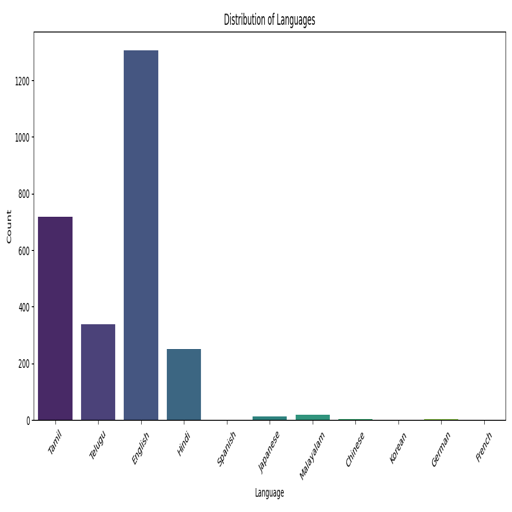
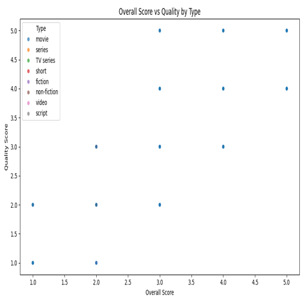
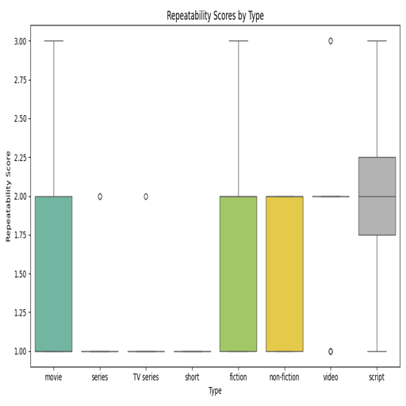

# Automated Analysis of media.csv

# Dataset Analysis README

## Introduction
This dataset encompasses a collection of media ratings, specifically focusing on films and possibly television series, recorded across various dates from 2005 to late 2024. The primary aim of this dataset is to analyze viewer ratings and understand trends in overall quality and repeatability of different titles, along with the language diversity of content provided.

## Dataset Summary
The dataset consists of various features including numeric and categorical variables:

### Numeric Variables:
- **Count**: 2651 entries were analyzed.
- **Overall Rating**: The average rating is approximately 3.05, with a minimum score of 1 and a maximum of 5. This indicates a moderate scoring range with some variation among ratings.
- **Quality Score**: The average quality rating is slightly higher at around 3.21, suggesting that viewers generally perceive the quality of the content to be above average.
- **Repeatability**: An average repeatability score of 1.49 indicates that, overall, most content is not considered highly repeatable or re-watchable, given the potential scoring out of 3.

### Categorical Variables:
- **Language**: The dataset contains movies in 11 different languages, with English dominating (1305 occurrences).
- **Type**: There are 8 content types identified, with movies being predominant (2210 occurrences).
- **Title**: A total of 2312 unique titles were recorded, reflecting a wide variety of content.
- **Actors**: Information about titles includes ratings attributed to 1528 different actors, with Kiefer Sutherland as the most frequently mentioned (48 ratings).

## Key Findings
1. **Language Diversity**: The analysis of the language distribution presents a clear inclination towards English-language media, a trend evidenced by the accompanying visualization, **language_distribution_bar.png**. The bar chart illustrates the overwhelming majority of content in English, which may suggest a preference or access issue for non-English speakers or creators.

   

2. **Viewer Ratings**: The average overall quality score of 3.21 alongside the repeatability score reveals audience perceptions of quality—indicative of satisfaction but not necessarily an endorsement for repeated viewings. The scatter plot depicted in **overall_quality_scatter.png** illustrates a correlation between ratings provided for overall and quality, indicating that higher quality scores often align with higher overall ratings.

   

3. **Content Repeatability**: The box plot in **repeatability_boxplot.png** demonstrates significant variance in repeatability scores, suggesting that while many titles receive low repeatability scores, a few stand out as highly re-watchable, which could inform content creators regarding viewer preferences for binge-worthy films.

   

## Insights
- The dominance of English-language media could point to market dynamics, where English-speaking audiences are favored, leading to a possible underrepresentation or insufficient recognition of non-English content creators.
- By analyzing viewer rating patterns, film distributors can better tailor their offerings to enhance viewer satisfaction and possibly shift viewer behavior towards higher repeatability titles.
- The correlation between quality and viewer ratings suggests that improving production quality could positively influence overall ratings and audience loyalty.

## Recommendations
- **Diversify Media Offerings**: To enhance viewer engagement and ensure more inclusive media representation, consider producing or acquiring more content in several different languages.
- **Quality Improvement Initiatives**: Content creators should focus on enhancing production quality as a means to directly impact viewer ratings and repeat engagement.
- **Encouraging Repeat Viewings**: By understanding the elements that make certain titles more repeatable, studios could incorporate similar themes or narratives into new productions to enhance re-watch potential.

## Conclusion
This dataset sheds light on viewer preferences in media consumption, highlighting the importance of both language accessibility and content quality. The insights and recommendations drawn from this analysis may serve as a guide for producers and distributors aiming to better meet audience expectations and cultivate consistent engagement.